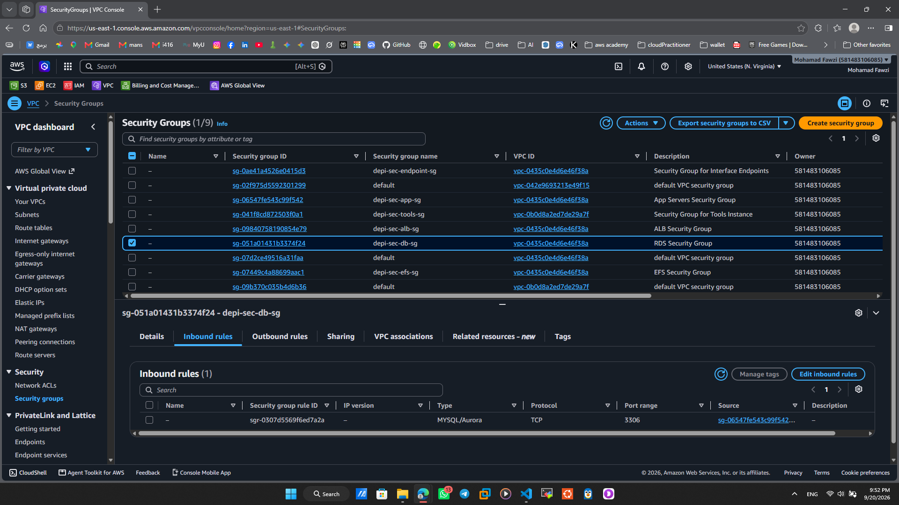
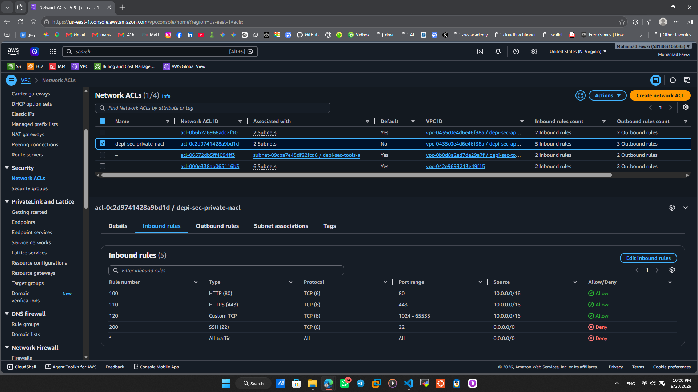
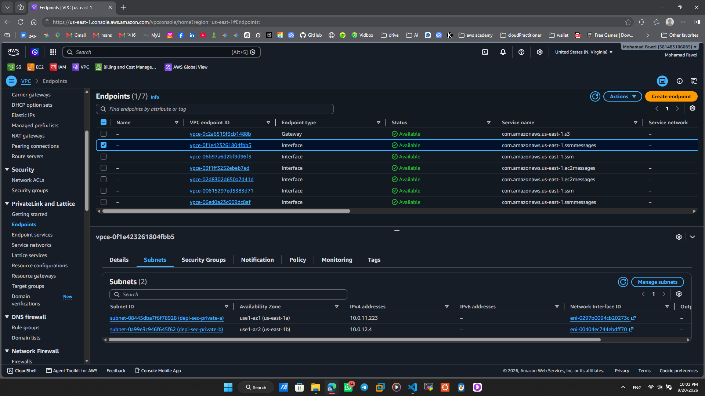
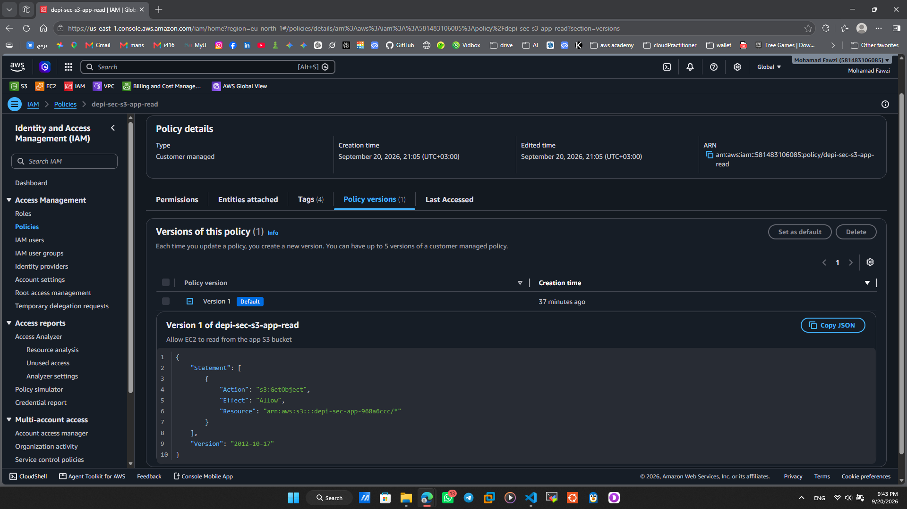
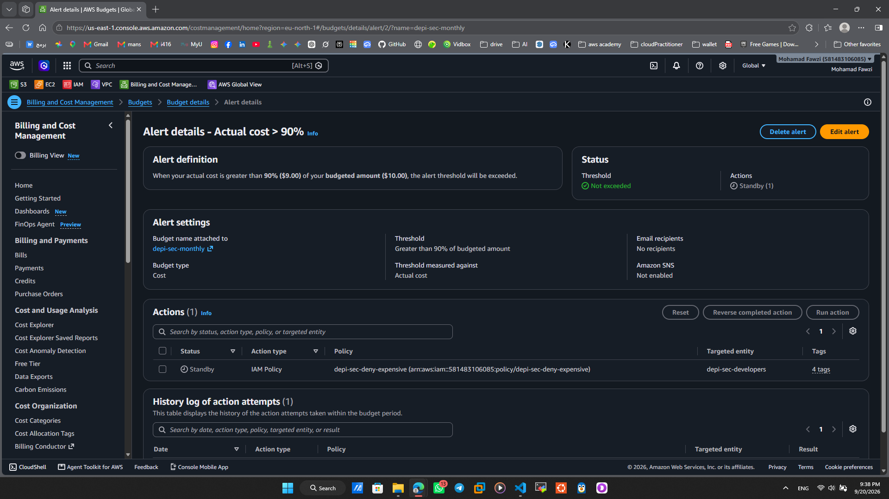

# Security Controls

| Control | AWS Service | Threat it stops | Evidence |
|---------|-------------|-----------------|----------|
| Stateful Firewall Tiering | Security Groups | Direct access to RDS or EFS from anywhere except the App Servers |  |
| Stateless Network Denial | Network ACLs | Misconfigured Security Groups accidentally allowing Port 22 |  |
| Private Service Access | VPC Endpoints | Traffic to AWS SSM or S3 traversing the public internet |  |
| IAM Least Privilege | IAM Policies | EC2 instances accessing S3 buckets they don't own |  |
| Cost Governance | AWS Budgets | Compromised credentials spinning up expensive crypto-mining EC2s |  |
| Forced HTTPS | S3 Bucket Policy | Man-in-the-middle attacks intercepting unencrypted data | *(Insert JSON here)* |